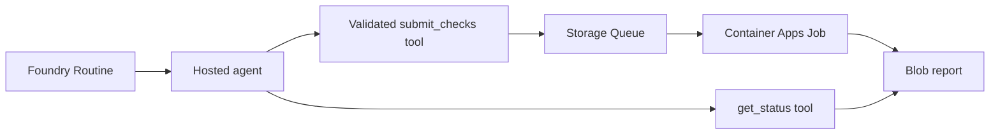

# Agents Decide, Containers Execute

A documentation-maintenance sample for **Agents Decide, Containers Execute**, presented by Minseok Song, Microsoft MVP.

Ask an agent to check a documentation snapshot. It selects approved checks, and a container worker produces a report showing one broken link and one translated page that needs review.

**[Explore the sample documents](docs/demo-walkthrough.md)** · **[Read the actual Azure report](samples/azure-report/report.md)**

| Input | Recorded result |
| --- | --- |
| [English index](docops/fixture/docs/en/index.md) links to a missing deployment guide | One broken internal link |
| [English setup guide](docops/fixture/docs/en/setup.md) has changed since the [Korean guide](docops/fixture/docs/ko/setup.md)'s recorded baseline | One translation review signal |

The linked report was downloaded from Azure Blob Storage after an actual execution. It is saved evidence, not a new live run. [Report origin and hashes](samples/azure-report/README.md) explain what was captured.

## How it works

A Routine invokes a hosted agent. The agent selects approved checks. A custom Python tool validates the request and queues it. A finite Container Apps Job checks a fixed repository snapshot and writes a report to Blob Storage. The agent does not receive shell access.



This integration uses custom application code. Foundry Routines do not directly configure a Container Apps Job in this example.

## Optional execution viewer

The `demo-viewer` folder provides a presentation-focused Execution evidence viewer. It keeps the Routine, agent, validation, queue, Job, and Blob report on one screen. It is not an operations dashboard.

```powershell
./demo-viewer/start.ps1
```

Open `http://127.0.0.1:8765`. Recorded Azure reads dated evidence, Local execution runs the local Python checks, and Azure Live can dispatch work or inspect an existing request using server-side credentials. Stages distinguish observed, recorded, inferred and simulated evidence. A reader error does not mark the Job failed. See [the Viewer README](demo-viewer/README.md) and [demo runbook](docs/demo-runbook.md).

## Try the example locally

Python 3.11 or later is sufficient for the local example; it has no third-party runtime dependencies. From this directory:

```powershell
python -m venv .venv
.venv/Scripts/Activate.ps1
python -m pip install -e .
python -m docops.cli demo
python -m unittest discover -s tests -v
```

On macOS/Linux, activate with `source .venv/bin/activate`. The remaining Python commands are identical.

The rehearsal uses a **scripted decision, SQLite, and a local worker**. It does not call an LLM, Foundry, or Azure. The cloud walkthrough below uses a real hosted agent and model.

Expected results for `docops-demo-001`:

| Check | Finding |
| --- | --- |
| `check_links` | `docs/en/index.md:6` links to missing `deploy.md` |
| `check_translation_drift` | `docs/ko/setup.md` has an older source baseline for `docs/en/setup.md` |

Reports: `.artifacts/local/reports/docops-demo-001/report.json` and `report.md`. The same request ID and payload reuse the logical result. A different payload with the same ID is a conflict.

## Deploy and run in Azure

Follow [Azure setup](docs/azure-setup.md) for resources, identities, hosted-agent deployment, and a disabled Routine. The [presentation runbook](docs/demo-runbook.md) begins with the published documents and saved report. Provision and rehearse separately if you choose to add a live execution.

- [Architecture and delivery semantics](docs/architecture.md)
- [Verification record](docs/verification.md)
- [Cleanup](docs/cleanup.md)
- [Official references](docs/references.md)

## Contract

```json
{
  "schema_version": 1,
  "request_id": "docops-demo-001",
  "repository_id": "docs-fixture-v1",
  "actions": ["check_links", "check_translation_drift"]
}
```

`WorkRequest.parse` rejects extra fields, unknown operations, arbitrary repositories, invalid IDs, and duplicate actions. Empty actions mean `no_action`; no job is queued. The model selects actions, but Python validates every tool request. Prompt instructions alone are not the boundary.

## Repository map

| Path | Purpose |
| --- | --- |
| `docops/contracts.py` | Validation and canonical request hash |
| `docops/checks.py`, `docops/fixture/` | Deterministic checks and fixed example |
| `docops/local.py` | Durable local rehearsal queue and leases |
| `docops/azure_io.py`, `docops/azure_worker.py` | Azure transport and finite worker |
| `agent/main.py` | Hosted agent, model client, and tools |
| `routines/manage.py` | Create, dispatch, inspect, and delete Routine |
| `infra/` | Bicep for Storage, ACR, identity, environment, and Job |
| `scripts/` | Deployment and status commands |
| `samples/` | Inputs and expected report |
| `tests/` | Contract, fixture, concurrency, retry, and deduplication tests |

## Scope and limitations

This is a teaching sample for a fixed, bundled repository snapshot. It does not clone arbitrary GitHub repositories, check external URLs, translate documents, open pull requests, or modify source files. The Markdown link parser intentionally supports a small subset of inline links; it is not a full Markdown AST. Drift compares normalized source hashes against a manifest, not translation quality.

Azure Storage Queue delivery can repeat. Blob leases and request hashes deduplicate a logical result, but the architecture does not promise exactly-once execution. Request-state creation and queue submission are separate operations; retry a failed submission with the same ID. A production system also needs reconciliation, alerting, retention, and an explicit dead-letter recovery policy. See the architecture notes for these boundaries.

The cloud dependencies are pinned in `requirements-cloud.txt`. `azure-ai-projects==2.6.1` satisfies the Agent Framework Foundry adapter's `<2.7.0` constraint. Routines are GA, although this SDK exposes them under `project.beta.routines`; the hosting adapter is a prerelease package. Recheck compatibility before upgrading.

## License

MIT. Microsoft and Azure product names are trademarks of their respective owners. This community example does not imply Microsoft endorsement.
